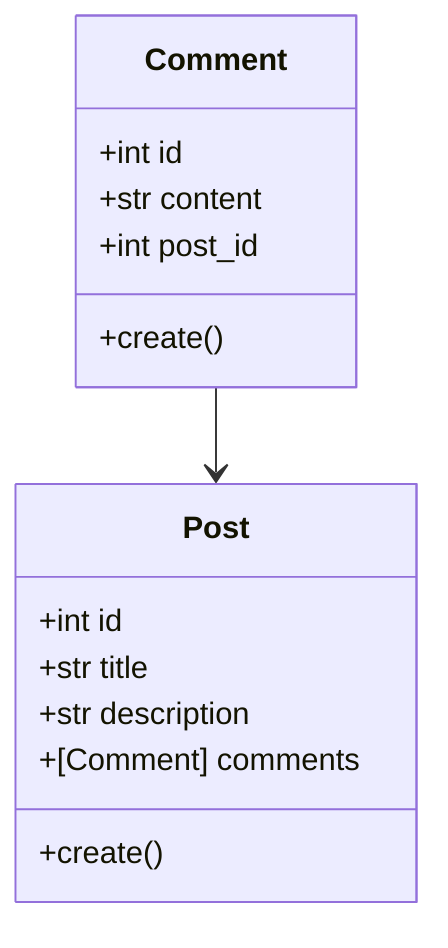

# Tangled - Nano Challange 2

## Intros

Halo semua! Perkenalkan saya Ghozy, pada kesempatan kali ini saya ingin berbagi tentang sebuah apps sederhana bernama **Tangled**. **Tangled** berdasarkan bahasa Inggris berarti **kusut**, sedangkan **Tangle(t)** dalam bahasa Jawa memiliki arti **tanya** sehingga aplikasi **Tangled** diharapkan dapat menjadi sebuah aplikasi untuk bertanya ketika kalian sudah merasa kusut terutama karena kerjain sebuah kodingan maupun design 🤪.

Aplikasi **Tangled** untuk saat ini masih berjalan pada platform iOS dan telah terintegrasi dengan ***micro-services***. Pada percobaan kali ini, saya menggunakan arsitektur DDD (*Domain-Drive Design*) pada ***backend service*** untuk mengatur data **post** dan **comment** yang telah di kirim/minta oleh **Tangled**.

## Let's having fun with Go

Oke, sebelum kita mulai bahsa lebih lanjut tentang gimana saya bikin *micro-services* dengan Go, mari kita bahas dulu kenapa harus dengan Go?

Pertama kalinya saya menggunakan Go itu sejak 2020 dan hal tersebut menjadi pengalaman baru bagi saya yang terbiasa menggunakan Python sebagai bahasa utama dalam mengerjakan tugas akhir kala itu. Sebagai bahasa yang katanya menjadi penyempurna dari bahasa C/C++, kini Golang sangat terkenal dan banyak digunakan oleh perusahaan baik *Start-up* maupun BUMN. Salah satu alasan mengapa Go menjadi terkenal karena kecepatannya dalam bekerja. Golang merupakan *statically-typed language* yang berarti Golang tidak memerlukan proses lebih untuk mentranslasi *code* yang ada layaknya *dynamically-typed language*, serta dikombinasikannya dengan fitur *concurrency* yang dapat mengoptimalkan jumlah *core* yang dimiliki sehingga dapat mempercepat Golang dalam memproses suatu *task*.

Untuk lebih lanjut dalam mengenal Go, kalian bisa melakukan *research* tersendiri yaa terkait Go!

## Micro-services

### Backend service

Pada bagian ini saya ingin sedikit menjelaskan tentang bagaimana DDD dapat bekerja pada Go (tentu *code* ini masih jauh dari kata sempurna, jadi mohon pengertiannya yaa). Sebelumnya saya sangat merekomendasikan kalian untuk membaca buku *Architecture Patterns with Python* yang ditulis oleh Harry J.W. Percival & Bob Gregory, meski buku tersebut memberikan contoh konsep DDD pada bahasa Python tapi konsep yang di terapkan cukup identik dengan yang saya terapkan pada Go kali ini.

Kita akan memulai dengan pembahasan **Domain Model**. Bagi teman-teman di Apple Developer Academy mungkin sudah tidak asing dengan kata *Domain Investigate* dan *General Investigate*. *Domain* dapat kita artikan secara sederhana sebagai hal/masalah yang ingin kita selesaikan. Pada kasus ini masalah yang akan kita selesaikan adalah bagaimana seorang *user* dapat bertanya maupun menjawab pertanyaan secara tak dikenal. Maka kali ini kita akan memiliki 2 entitas diantaranya Post dan Comment seperti ilustrasi dibawah ini.

## Domain Model



Setelah kita membuat *Domain Model*, kita akan sedikit membahas tentang *repository pattern*. *Repository* adalah sebuah *layer* yang bekerja tepat sebelum *database layer*, dimana *repository pattern* merupakan bentuk abstraksi terhadap penyimpanan yang persisten sehingga kita dapat mengatur kapan dan bagaimana kita menyimpan data pada memori maupun pada *database*.

Catatan: Sebenarnya untuk sebuah *service* yang hanya membuat CRUD sederhana seperti ini kita tidak perlu menggunakan konsep *Domain Model* dan *repository pattern* karena akan membutuhkan usaha yang lebih dibandingkan dengan penggunaan ORM/*ActiceRecord pattern*. ***Penerapan ini hanya sebagai bentuk pembelajaran semata.***

Berikut merupakan potongan *code* dari salah satu fungsi untuk menyimpan data *comment* dari *comment repository*.

```
func (r *CommentRepo) SaveComment(comment *domain.Comment) (*domain.Comment, map[string]string) {
 dbErr := map[string]string{}

 err := r.db.Debug().Create(&comment).Error
 if err != nil {
  //any other db error
  dbErr["db_error"] = "database error"
  return nil, dbErr
 }
 return comment, nil
}
```
