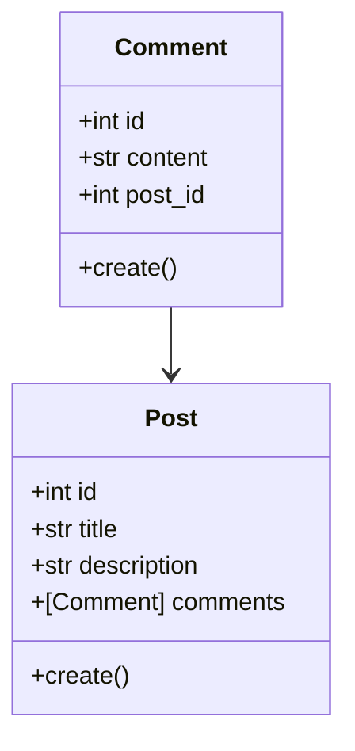

# Tangled - Nano Challange 2

## Intros

Halo semua! Perkenalkan saya Ghozy, pada kesempatan kali ini saya ingin berbagi tentang sebuah apps sederhana bernama **Tangled**. **Tangled** berdasarkan bahasa Inggris berarti **kusut**, sedangkan **Tangled** dalam bahasa Jawa memiliki arti **tanya** sehingga aplikasi **Tangled** diharapkan dapat menjadi sebuah aplikasi untuk bertanya ketika kalian sudah merasa kusut terutama karena kerjain sebuah kodingan maupun design 🤪.

Aplikasi **Tangled** untuk saat ini masih berjalan pada platform iOS dan telah terintegrasi dengan ***backend services***. Pada percobaan kali ini, saya menggunakan arsitektur DDD pada ***backend service*** untuk mengatur data **post** dan **comment** yang telah di kirim/minta oleh **Tangled**.

## Domain Model

