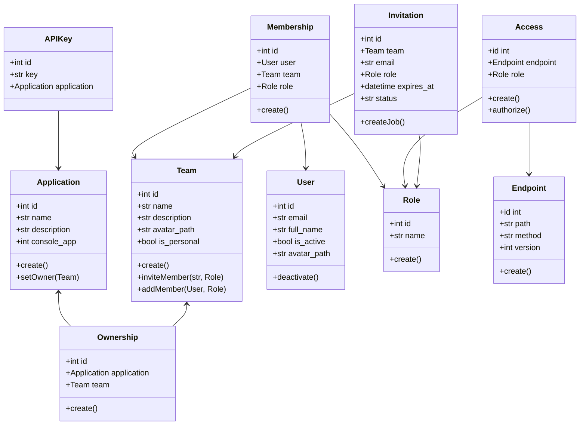
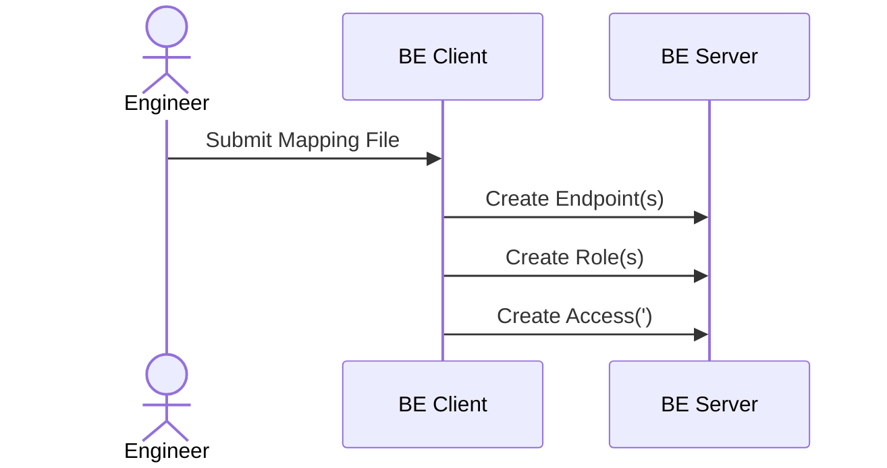
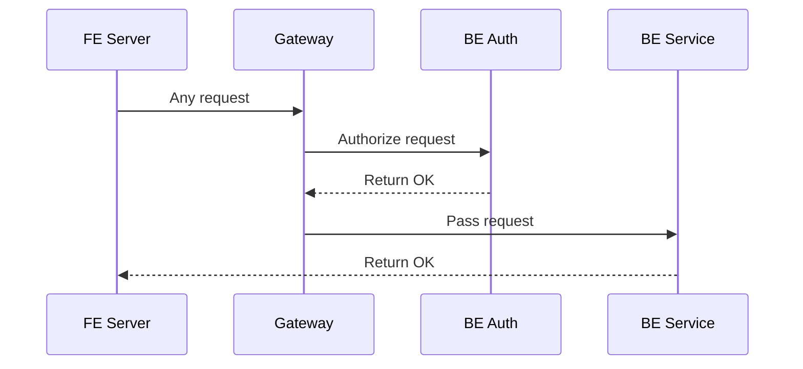
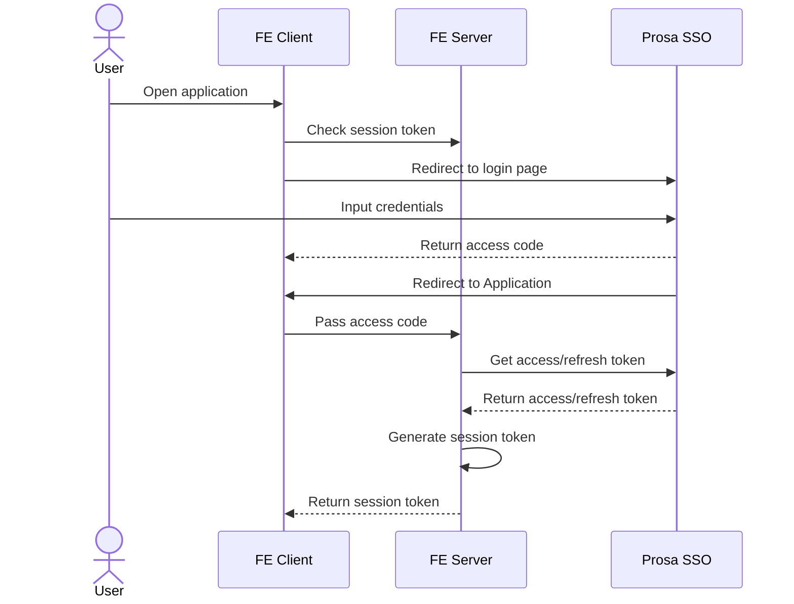
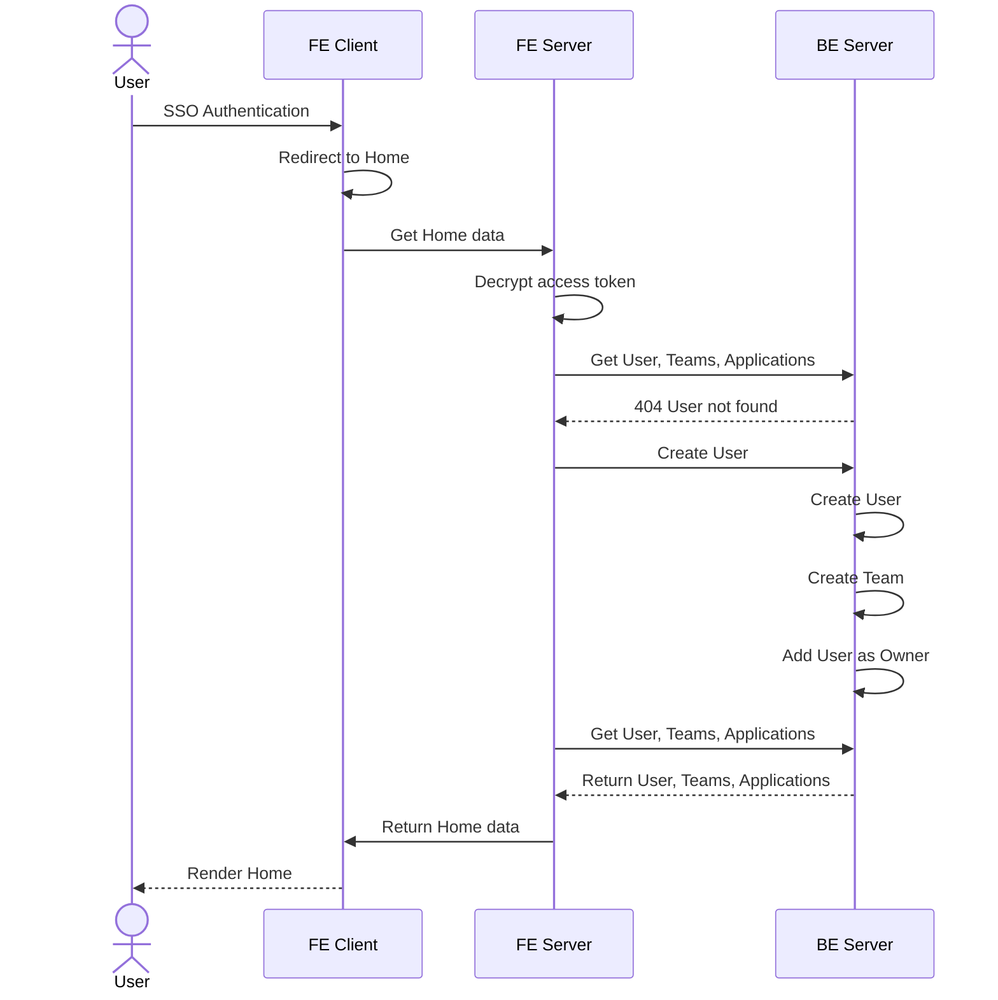
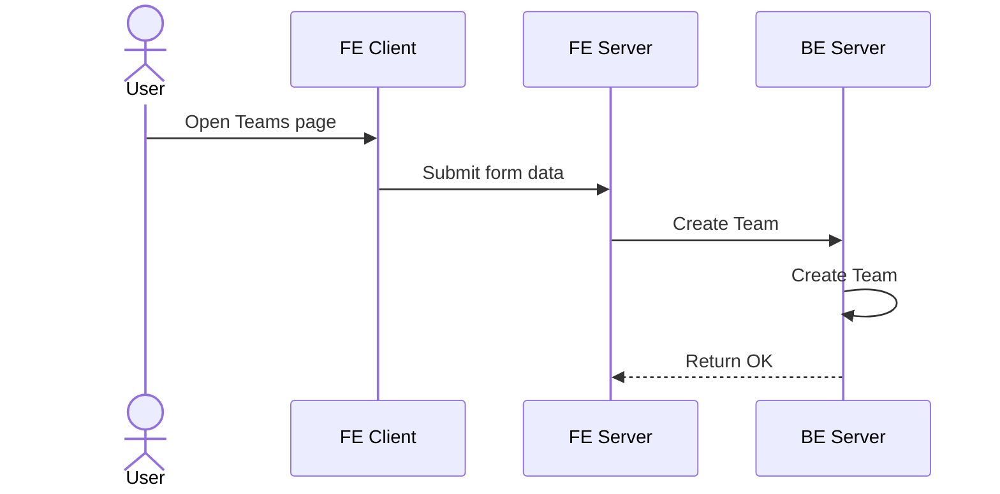
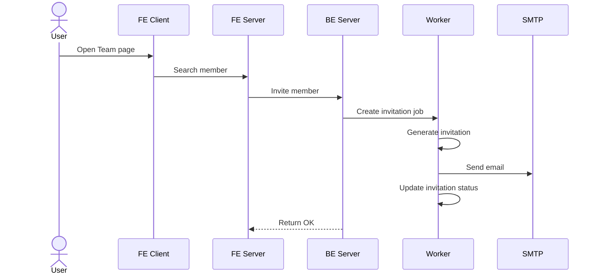
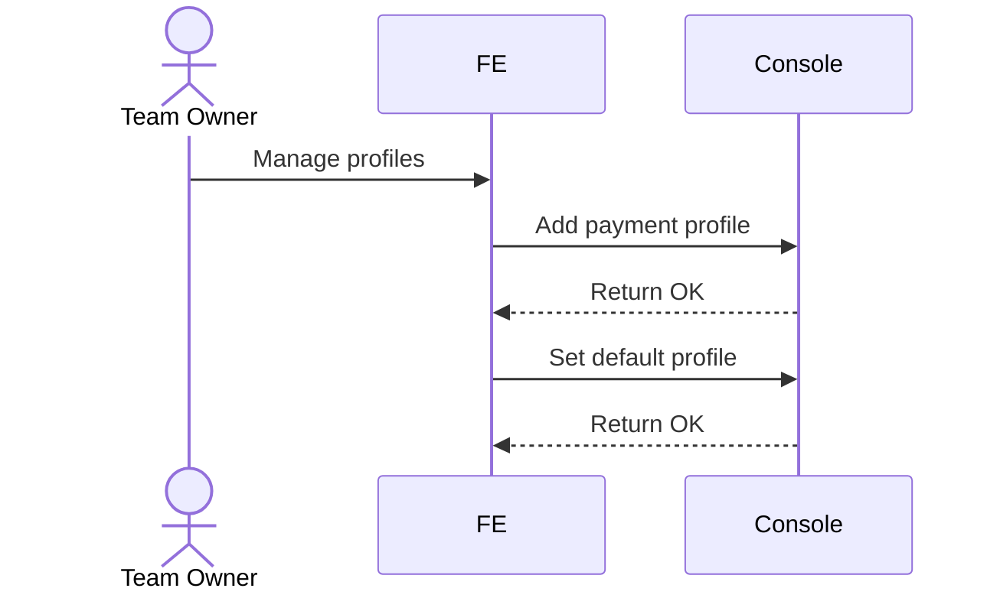
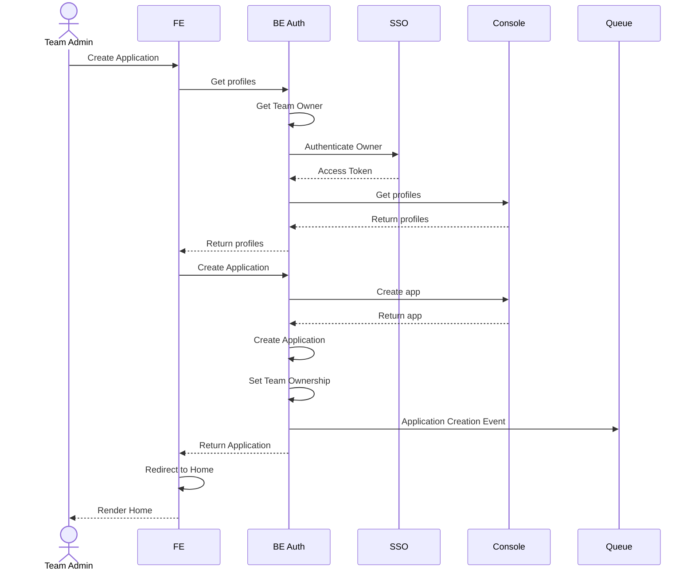

# Authorization Service

## Objectives

1. Implement **Access** Control to authorize **User** access to Conversa
**Applications** and their **Endpoints** based on the user's **Role** within a
**Team**.
2. Implement **Applications** within the Authorization context, their **Team**
ownership, and the surrounding Console interaction.
3. Manage **Team** **Membership** and **Invitations**.

## Domain Model

## Use Cases

### Access Control

**Access** is defined as a mapping between a **Role** and an **Endpoint**. The
funcionality to create access mappings is not provided to users directly (yet).
Instead, these mappings should be defined when the service is initialized. Keep
in mind that functionality is distributed accross several services, and that the
Endpoints registered here reflect all these services.

Requests made to any backend services need to be authorized. Authorization can
occur at the boundary between frontend and backend using an API Gateway, *or* at
the frontend (server-side) by providing a complete list of access mapping for
each user for the frontend to check. All request *must* contain the
Application's APIKey and the User's access token in the header.

### SSO Authentication

All user-facing operations within the system are preceeded by authentication
via SSO. This sequence is irrelevant to backend services, but is placed here for
convenience.

### First Login

During the first login ie. accessing the application for the first time after
registration, after logging in via SSO the User needs to be added to the authorization
service. A private Team is created with the new User as the owner.

Subsequent logins will return User, Teams, and Applications data without
encountering the 404. Subequent diagrams will assume the User is logged in and
at Home.

### Team Management

Teams are used to define the relationship between Applications and Users.
Applications are owned by Teams, not by Users. It is the User's Role within the
Team that determines which functionality (of the Team's Applications) the User
has Access to.

Team creation should be straightforward. Teams *must* have at least one Member,
and exactly one Member *must* have the Role of `owner`. A Team is said to be
`personal` when it can only have one member at most.

Members are added to Teams with a specified Role. If the User is already
registered within the system, they can be searched when inviting new members.
Regardless of whether the User to be added is registered within the system
(Prosa SSO), an email invitation is sent to the User. Following the invitation
link given in the email, after authentication, the User is explicitly prompted
to accept/deny the invitation. Invitations can be accepted, declined, expired,
and pending. Unacknowledged invitations expire after a specified amount of time.

### Application Management

Applications are the primary method of storing Chatbots. The functionality of
Applications are distributed across multiple services. The Authorization Service
is responsible for interacting with the Console for the quota and payment-related
functionality of Applications.

In order to create Applications, the Team Owner must have at least one Payment
Profile. This is outside of the scope of this service, but is placed here for
convenience.

Applications are created in the context of a Team, and are created using the
Console credentials of the Team Owner.

